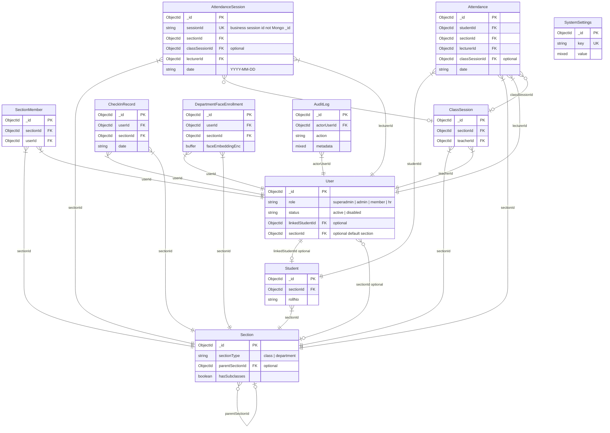

# Data model and ERD (Smart Face Attendance)

This document is the source of truth for MongoDB collections, relationships, and how class attendance differs from department (employee) flows.

## Actor types

| Actor | Storage | Notes |
|--------|---------|--------|
| **superadmin**, **admin**, **member**, **hr** | `User.role` | Only `User` documents authenticate via `/api/auth`. |
| **Student** | `Student` collection | Class roster; face images for recognition. Not a login unless a `User` is linked. |
| **Optional link** | `User.linkedStudentId` → `Student` | Optional (e.g. guardian/student portal). Most students have **no** `User`. |

## Two domain flows (do not merge mentally)

1. **Class / academic attendance** — sections with `sectionType: 'class'`: `Student`, `ClassSession`, `Attendance`, `AttendanceSession`.
2. **Department / employee** — sections with `sectionType: 'department'`: `User`, `CheckInRecord`, `DepartmentFaceEnrollment` (embedding-based recognition for staff in that department).

---

## Entity relationship diagram

### `AttendanceSession` fields (common diagram mistake)

- **`_id`**: MongoDB primary key.
- **`sessionId`**: separate **string**, unique business identifier for the roll-call session (not a duplicate of `sectionId`).
- **`sectionId`**: single reference to `Section` (ObjectId).

---

## Collection ↔ file map

| Collection | Model file |
|------------|------------|
| `users` | `backend/models/User.js` |
| `students` | `backend/models/Student.js` |
| `sections` | `backend/models/Section.js` |
| `sectionmembers` | `backend/models/SectionMember.js` |
| `classsessions` | `backend/models/ClassSession.js` |
| `attendances` | `backend/models/Attendance.js` |
| `attendancesessions` | `backend/models/AttendanceSession.js` |
| `checkinrecords` | `backend/models/CheckInRecord.js` |
| `departmentfaceenrollments` | `backend/models/DepartmentFaceEnrollment.js` |
| `auditlogs` | `backend/models/AuditLog.js` |
| `systemsettings` | `backend/models/SystemSettings.js` |

---

## Indexes worth knowing

- `Student`: unique `(rollNo, sectionId)`.
- `SectionMember`: unique `(sectionId, userId)`.
- `Attendance`: uniqueness rules on `(studentId, classSessionId, date)` and legacy `(studentId, sectionId, date, sessionId)` (sparse).
- `CheckInRecord`: unique `(userId, sectionId, date)`.
- `DepartmentFaceEnrollment`: unique `(userId, sectionId)`.

---

## API access by role (summary)

See route files under `backend/routes/` for exact paths. In short:

- **superadmin**: `/api/superadmin/*`, plus broad access elsewhere where authorized.
- **admin** + **superadmin**: most user/section/student admin APIs.
- **member**: class sessions, attendance, students (enroll/list), reports.
- **hr**: employee enroll, section members, check-in, reports; not attendance session routes as currently restricted.

Face HTTP APIs: `/api/face/enroll`, `/api/face/verify` (authenticated; see `face.routes.js`).
